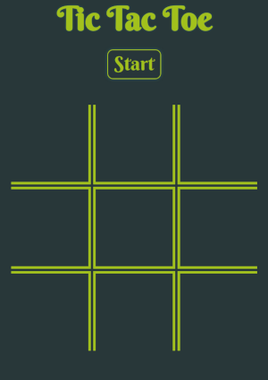
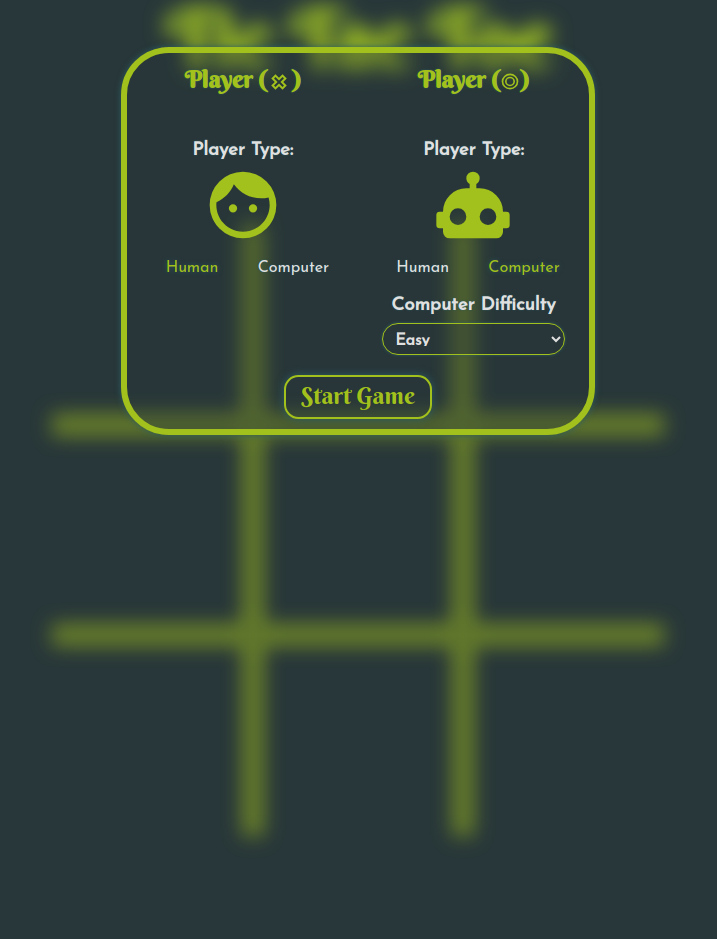
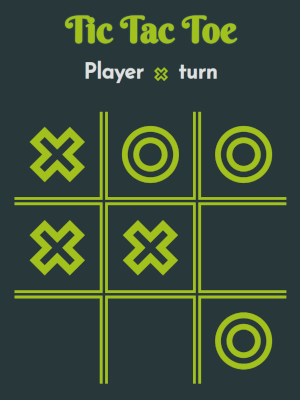

# Odin Tic Tac Toe

This is an implementation of the classic Tic Tac Toe game, created as part of The Odin Project curriculum. The project aims to provide a fun and entertaining way to learn and practice JavaScript, CSS, and HTML skills.

## Features

- Play against a human opponent
- Play against the computer with two levels of difficulty
- Simple and intuitive user interface

## Demo

You can try out the game by visiting the following link: [Odin Tic Tac Toe](https://hrv3str.github.io/odin-tic-tac-toe/)

## How to Play

1. Click the "Start" button to begin the game.
2. In the form that appears, choose which player will be human or computer. The default is human vs. human.
3. If the CPU player is selected, you can choose its difficulty level (easy or normal). The default is easy.
4. Click the "Start Game" button to start playing.
5. Follow the conventional Tic Tac Toe rules to play the game.
6. When the match is finished, you can restart it by clicking the "Try Again" button.

## Technologies Used

- HTML
- JavaScript
- CSS
- Icons from [Pictogrammers](https://pictogrammers.com/)

## Contributing

Contributions to this project are not required as it is intended as a learning project. However, if you have any ideas or improvements, feel free to create an issue or pull request on the GitHub repository.

## License

This project is licensed under the MIT License - see the [LICENSE](LICENSE) file for details.

## Author

- Roman Novikov
- GitHub: [hrv3str](https://github.com/hrv3str)

## Acknowledgments

- The [Odin Project](https://www.theodinproject.com/) for providing a great curriculum and learning resources.
- OpenAI and [ChatGPT](https://chat.openai.com/) for assisting.
- [Pictogrammers](https://pictogrammers.com/) for providing the icons used in the project.
